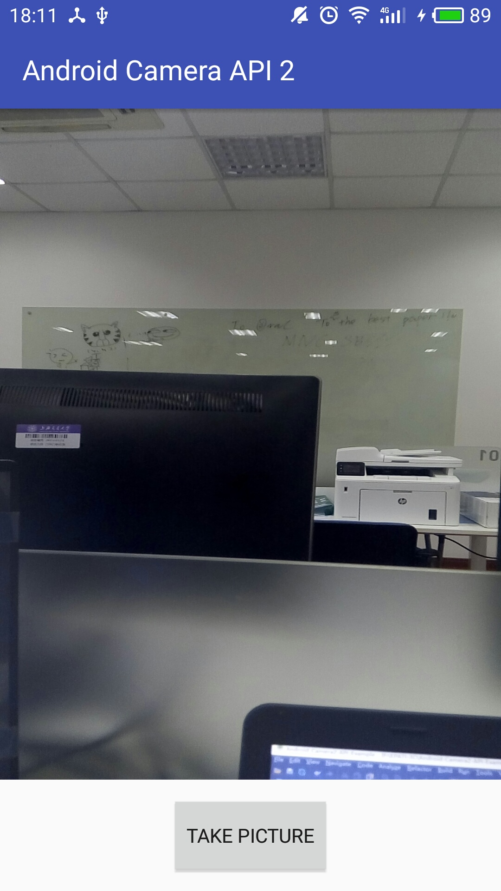

# Android-Camera2-API-Example
Android Camera2 API Example Tutorial

## Requirements
- Android Studio 3.0.1
- Min SDK >= Android SDK 21

## Screenshot
<!--  -->

## Acknowledgement

[ANDROID CAMERA2 API EXAMPLE TUTORIAL](https://inducesmile.com/android/android-camera2-api-example-tutorial/)

